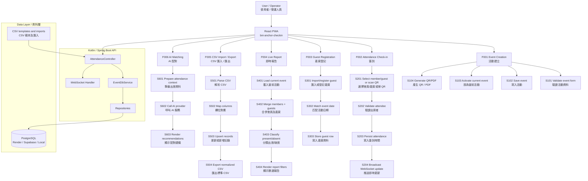

# EventXP System / BNI Anchor Check-in

EventXP System is a full-stack event check-in platform for BNI chapter meetings (Anchor, AMax, Dynasty, and other chapters). It supports event creation, QR attendance, member and guest check-in, live reporting, CSV import/export, and AI-assisted networking recommendations.

EventXP System 是一個為 BNI 分會會議而設的全端活動簽到系統（支援 Anchor、AMax、Dynasty 等多 chapter），支援活動建立、QR 簽到、會員及嘉賓管理、即時出席報告、CSV 匯入/匯出，以及 AI 輔助商務配對建議。

This README uses a traceability framework: **Feature Codes** (`F001`, `F002`) identify product capabilities, while **Step Codes** (`S001`, `S002`) identify important process blocks inside those capabilities. The goal is to help developers, operators, and AI coding agents locate logic quickly and edit the correct code path safely.

本文件採用可追蹤框架：**功能編號**（如 `F001`、`F002`）代表產品能力，**步驟編號**（如 `S001`、`S002`）代表該功能內的重要流程。目標是讓開發者、營運人員及 AI Coding Agent 可快速定位錯誤及安全修改指定邏輯。

## Architecture Overview | 系統架構



## Traceability Matrix | 追蹤矩陣

| Feature Code 功能編號 | Feature 功能 | Primary Steps 主要步驟 | Main Areas 主要位置 |
|---|---|---|---|
| `F001` | Event Creation / 活動建立 | `S101` validate, `S102` save, `S103` activate, `S104` QR/PDF | `QRGeneratorPanel.tsx`, `EventDbService.kt`, `AttendanceController.kt` |
| `F009` | Event Management / 活動管理 | `S901` list/activate, `S902` edit name/times, `S903` regenerate PDF, `S904` import/export CSV | `EventManagementPanel.tsx`, `EventEditModal.tsx`, `EventDbService.kt`, `PUT /api/events/{id}` |
| `F002` | Attendance Check-in / 簽到 | `S201` select/scan, `S202` verify, `S203` persist, `S204` broadcast | `CheckinFormPanel.tsx`, `MemberCheckinPanel.tsx`, `GuestCheckinPanel.tsx`, `AttendanceController.kt` |
| `F003` | Guest Registration / 嘉賓登記 | `S301` import/register, `S302` match event date, `S303` store guest row | `PublicGuestWalkinPage.tsx`, `GuestsPage.tsx`, `GuestRepository.kt` |
| `F004` | Live Report / 即時出席報告 | `S401` load event, `S402` merge records, `S403` classify status, `S404` render filters | `ReportPage.tsx`, `EventAttendanceDetailModal.tsx`, `EventDbService.kt` |
| `F005` | CSV Import / Export / CSV 匯入匯出 | `S501` parse, `S502` map columns, `S503` upsert, `S504` export | `ImportPage.tsx`, `BulkImportService.kt`, `EventManagementPanel.tsx`, `scripts/import-member-csv-chapter.py` |
| `F006` | AI Matching / AI 配對 | `S601` prepare context, `S602` AI request, `S603` render result | `StrategicPlanningPanel.tsx`, `DeepSeekService.kt` |
| `F007` | Environment & Deployment / 環境及部署 | `S701` env load, `S702` datasource profile, `S703` startup, `S704` health/logs | `.env.example`, `run.sh`, `scripts/run_local_with_remote_db.sh`, Spring profile files |
| `F008` | Member Management / 會員管理 | `S801` list by category, `S802` edit name/profession/standing, `S803` upsert by id or name | `MembersPage.tsx`, `memberCategories.ts`, `MemberManagementController.kt`, `DatabaseMemberService.kt` |
| `F010` | Multi-Chapter / 多 chapter | `S1001` resolve chapter, `S1002` client login, `S1003` scope API/DB, `S1004` bulk import by chapter | `chapterContext.tsx`, `ChapterService.kt`, `migrations/add_chapters_and_member_chapter_id.sql`, `ImportPage.tsx` |

## Production | 正式環境

| Service | URL |
|---|---|
| Frontend (Vercel) | <https://bni-anchor-checkin.vercel.app> |
| Admin (BNI Anchor) | <https://bni-anchor-checkin.vercel.app/admin> |
| Admin (other chapters) | <https://bni-anchor-checkin.vercel.app/admin?client=true&chapter=amax> — login with chapter AdminLogin (e.g. `amax`) |
| Live report | <https://bni-anchor-checkin.vercel.app/report> |
| Backend API (Render) | <https://bni-anchor-checkin-backend.onrender.com> |
| Chapters API | <https://bni-anchor-checkin-backend.onrender.com/api/chapters> |

Latest production tags:

- **Monorepo** (`bni-checkin`, branch `master`): `prod/6.1.2` — multi-chapter member import (`name,profession,chapter`), client chapter login, event edit + PDF regen
- **Backend deploy repo** (`bni-anchor-checkin-backend`, branch `main`): `prod/6.1.1` — per-row chapter on bulk member import, chapter-scoped members API

Render watches the **separate backend repository** `burkaslarry/bni-anchor-checkin-backend` on `main`, not this monorepo. After changing backend code here, sync `bni-anchor-checkin-backend/` to that repo and push before tagging or deploying.

**Vercel production deploy (SRAA-aligned):** run audit, tests, and build before release:

```bash
./scripts/deploy-vercel-production.sh
# or: make deploy-vercel-prod
# or: cd bni-anchor-checkin && npm run deploy:vercel:prod
```

See [Deployment Guide](./docs/guides/DEPLOYMENT.md) for full steps and audit log location (`docs/security/`).

正式環境由 Vercel（前端）及 Render（後端）託管。後端實際 deploy 來自獨立 repo `bni-anchor-checkin-backend`；修改 monorepo 內後端程式後，需同步至該 repo 再 push / deploy。

## Code Block Standard | 代碼註解規範

Use trace comments only around meaningful logic blocks: API boundaries, persistence decisions, data merges, event-date matching, CSV transforms, or AI calls. Avoid tagging every small line.

只在有實際追蹤價值的邏輯區塊使用追蹤註解，例如 API 入口、資料寫入決策、資料合併、活動日期匹配、CSV 轉換或 AI 呼叫。不要每行都加標籤。

### TypeScript example

```ts
/**
 * [F002][S201]
 * Feature: Attendance Check-in
 * Step: Select attendee type
 * Description: Keeps member and guest check-in modes mutually exclusive.
 */
function setCheckinMode(mode: "member" | "guest") {
  setCheckinType(mode);
}
```

### Kotlin example

```kotlin
/**
 * [F004][S402]
 * Feature: Live Report
 * Step: Merge members and guests
 * Description: Combines persisted member attendance with guest check-in rows for one event date.
 */
fun getReportData(eventId: Int? = null): ReportData? {
    // Logic starts here...
}
```

### Inline log example

```kotlin
log.warn(
    "[F002][S203] Guest check-in DB row not resolved: name={}, eventDate={}",
    attendeeName,
    eventDate
)
```

## Quick Start | 快速啟動

### English

1. Install prerequisites: Node.js `20.19+`, npm, Java `17+`, and PostgreSQL if running a local database.
2. Clone and enter the repository:

```bash
git clone <repo-url>
cd bni-checkin
```

3. Install frontend dependencies:

```bash
make install
```

4. Configure environment variables:

```bash
cp .env.example .env
```

Fill in local or remote database values. For local PostgreSQL, create `bni_checkin` and import the schema:

```bash
psql bni_checkin < init-database.sql
```

5. Start the full local stack:

```bash
sh run.sh
```

Useful local URLs:

- Frontend: <http://localhost:5173>
- Admin: <http://localhost:5173/admin>
- Live report: <http://localhost:5173/report>
- Backend API: <http://localhost:10000>
- Swagger UI: <http://localhost:10000/swagger-ui.html>

### 繁體中文

1. 安裝前置需求：Node.js `20.19+`、npm、Java `17+`；如使用本地資料庫，亦需 PostgreSQL。
2. 複製並進入專案：

```bash
git clone <repo-url>
cd bni-checkin
```

3. 安裝前端依賴：

```bash
make install
```

4. 設定環境變數：

```bash
cp .env.example .env
```

按需要填寫本地或遠端資料庫連線。如使用本地 PostgreSQL，建立 `bni_checkin` 後匯入 schema：

```bash
psql bni_checkin < init-database.sql
```

5. 啟動本地全端服務：

```bash
sh run.sh
```

常用本地網址：

- 前端：<http://localhost:5173>
- 管理後台：<http://localhost:5173/admin>
- 即時報告：<http://localhost:5173/report>
- 後端 API：<http://localhost:10000>
- Swagger UI：<http://localhost:10000/swagger-ui.html>

## Remote Database Mode | 本地服務連遠端資料庫

Use this when testing localhost UI/API against Render or Supabase PostgreSQL.

當需要用本地前端及 API 連接 Render 或 Supabase PostgreSQL，可使用以下方式。

```bash
cp .env.example .env
# Fill DATABASE_* for Render, or SUPABASE_DATABASE_* for Supabase.
bash scripts/run_local_with_remote_db.sh
```

Profiles:

- `REMOTE_DB_PROFILE=render`: uses `DATABASE_JDBC_URL`, `DATABASE_USERNAME`, `DATABASE_PASSWORD`.
- `REMOTE_DB_PROFILE=supabase`: uses `SUPABASE_DATABASE_JDBC_URL`, `SUPABASE_DATABASE_USERNAME`, `SUPABASE_DATABASE_PASSWORD`.
- `REMOTE_DB_PROFILE=properties`: uses `LOCAL_DATABASE_JDBC_URL`, `LOCAL_DB_USER`, `LOCAL_DB_PASSWORD`.

## Manual Development | 手動開發指令

```bash
make help
make frontend-dev
make backend-dev
make test
make build
make deploy-vercel-prod   # SRAA gate + Vercel production deploy
```

Direct commands:

```bash
cd bni-anchor-checkin-backend
./gradlew bootRun
```

```bash
cd bni-anchor-checkin
npm run dev
```

## Project Structure | 專案結構

```text
.
├── bni-anchor-checkin/             # React, TypeScript, Vite PWA
├── bni-anchor-checkin-backend/     # Kotlin, Spring Boot API
├── data/                           # CSV sources and import templates
│   ├── templates/                  # member-import-template.csv (name,profession,chapter)
│   └── amax-member-list-chapter.csv  # AMax members (chapter=amax)
├── docs/                           # User, setup, deployment, and training docs
├── init-database.sql               # Local database schema/bootstrap script
├── Makefile                        # Root-level command shortcuts
├── run.sh                          # Local full-stack launcher
└── scripts/                        # Operational helper scripts
```

## Multi-Chapter & Member Import | 多 chapter 與會員匯入

Members, events, guests, and observers are scoped by **chapter** (`bni_eventxp_chapters`). Seeded chapters: `anchor`, `amax`, `dynasty`.

| Context | Default chapter |
|---|---|
| BNI Anchor admin (`/admin`) | `anchor` |
| Bulk import — `chapter` column empty | Current login chapter (Anchor → `anchor`; client login `amax` → `amax`) |
| API query | `GET /api/members?chapter=amax` (omit or `anchor` for Anchor) |

**Member CSV format** (template: `data/templates/member-import-template.csv`):

```csv
name,profession,chapter
John Doe,Software Development,anchor
Rex Lee,髮型師,amax
```

- UI: **Admin → 批量匯入** (`/admin/import`) — member rows write to the logged-in chapter unless `chapter` is set per row.
- CLI convert + import:

```bash
python3 scripts/convert-member-csv-to-chapter-format.py \
  data/amax-member-list-0415.csv data/amax-member-list-chapter.csv amax

python3 scripts/import-member-csv-chapter.py data/amax-member-list-chapter.csv
```

- Bulk API: `POST /api/bulk-import-members?chapter=amax` — body is JSON array; each row may include optional `"chapter"` to override.

Apply DB migrations for chapters: `migrations/add_chapters_and_member_chapter_id.sql`, `migrations/add_chapter_id_events_guests_observers.sql` (Render Postgres via `render psql`).

## Core Runtime Notes | 核心運作備註

- Creating an event from **Admin → 產生 QR 碼** should activate that event so check-in, report, and export target the same meeting.
- **Admin → 活動管理** lists all events. Operators can activate, import/export attendance CSV, view attendance grid, and **edit** event name, start time, and end time (`✏️ 編輯`). On save, the updated QR flyer PDF downloads automatically.
- Event update API (DB mode): `PUT /api/events/{eventId}` with JSON `{ "name"?, "startTime"?, "endTime"? }` (at least one field). Times use `HH:mm` or `HH:mm:ss`.
- Member attendance is stored in `bni_anchor_attendances`.
- Guest registration and guest check-in time are stored in `bni_anchor_guests`, including `check_in_time`.
- `/report` merges member attendance, checked-in guests, and registered-but-not-checked-in guests for the active event date.
- WebSocket updates refresh operator-facing screens after attendance, event, and registry changes.
- **Admin → 會員管理** (`/admin/members`) lists members for the active chapter, grouped by poster profession categories (A–K). Operators can edit name, profession, category, and standing.
- Member names may include `/` (e.g. `Max Chan/William Lai`). Use query-param APIs — **not** path variables (add `?chapter=` when not Anchor):
  - `GET /api/members?chapter=amax`
  - `PUT /api/members?memberId={id}&chapter=anchor` (preferred)
  - `PUT /api/members?currentName={name}`
  - `DELETE /api/members?memberId={id}` or `?name={name}`
- Member attendance supports optional **substitute_for** (替代人): recorded after check-in in the success popup, stored on `bni_anchor_attendances`, shown on `/report`, and exported in CSV column `替代人`. Members can be marked absent from the report records table.
- **Admin → 嘉賓管理** supports guest rename and keyword search when **全部活動 / All Events** is selected.
- Member sync scripts: `scripts/import-members-from-poster-2026-07.py`, `scripts/sync-local-members-from-poster.sh`, `scripts/update-production-members-2026-07-10.py`.
- Chapter member scripts: `scripts/convert-member-csv-to-chapter-format.py`, `scripts/import-member-csv-chapter.py`.
- Operational scripts: `scripts/cleanup-test-events.sh` (soft-delete events whose name contains `TEST`), `scripts/deploy-vercel-production.sh` (SRAA pre-deploy gate).

## Documentation | 相關文件

- [Frontend README](./bni-anchor-checkin/README.md)
- [Backend README](./bni-anchor-checkin-backend/README.md)
- [Setup Guide](./docs/guides/SETUP.md)
- [Quick Reference](./docs/guides/QUICK_REFERENCE.md)
- [User Guide](./docs/guides/USER_GUIDE.md)
- [CSV Import Schema](./docs/CSV_IMPORT_SCHEMA.md)
- [Deployment Guide](./docs/guides/DEPLOYMENT.md)
- [DeepSeek Setup](./docs/guides/DEEPSEEK_SETUP.md)
- [Strategic Seating Guide](./docs/guides/STRATEGIC_SEATING_GUIDE.md)

## Reflection & Quality Check | 反思與品質檢查

Potential blind spots:

- `S203` persistence can be split across multiple endpoints (`/api/checkin`, `/api/attendance/log`, `/api/attendance/scan`). Keep all guest/member write paths tagged and tested.
- `S302` event-date matching is sensitive to imported CSV data quality. Trim dates and log both the requested event date and matched guest row.
- `S402` report merging can hide bugs if duplicate names exist across member and guest records. Prefer keys using `role + normalizedName`, and consider adding stable IDs to report rows.
- `S501` CSV parsing should avoid ad hoc string splitting when quoted CSV fields are expected. Prefer a parser when import formats become more complex.
- `S602` AI calls should degrade gracefully when API keys or providers are unavailable.

Log readability improvements:

- Prefix important logs with `[Fxxx][Sxxx]`, for example `[F002][S203]`.
- Include stable identifiers: `eventId`, `eventDate`, `attendeeName`, `role`, and repository result counts.
- Use `warn` for recoverable mismatches, `error` for failed writes or external service failures, and `info` for operator-relevant lifecycle events.
- Keep user-facing messages bilingual where the operator needs immediate action; keep developer logs concise and searchable.

## License | 授權

Proprietary commercial prototype. See [LICENSE.md](./LICENSE.md) before distribution, reuse, or production deployment.

本專案為專有商業原型。分發、重用或正式部署前，請先閱讀 [LICENSE.md](./LICENSE.md)。
