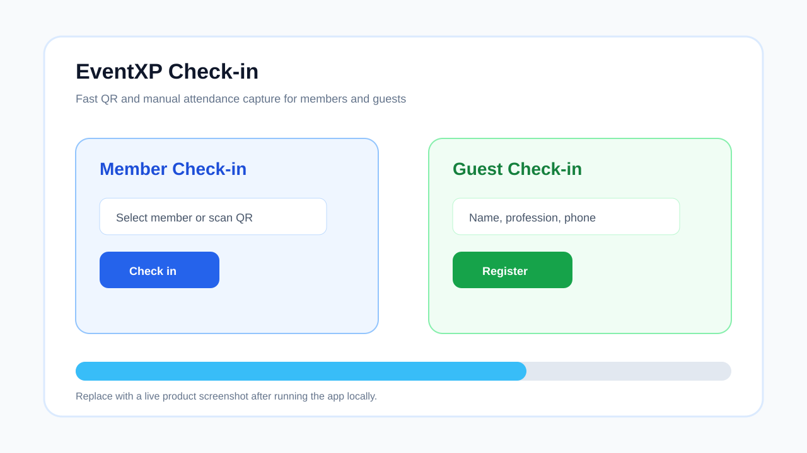
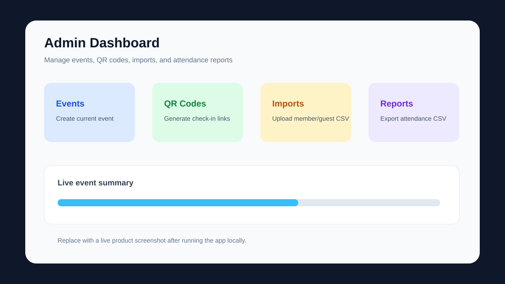
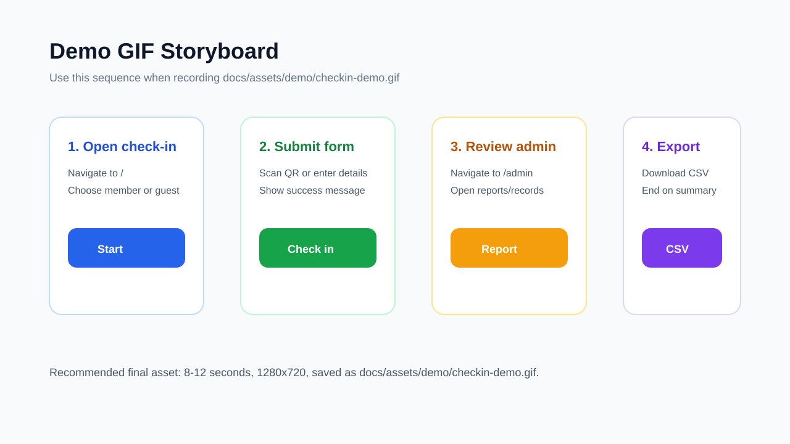

# EventXP / BNI Anchor Check-in

EventXP is a full-stack event check-in platform built for BNI Anchor Chapter events. It combines QR-based attendance, member and guest registration, admin reporting, CSV export, and AI-assisted networking recommendations.

The repository contains a React PWA frontend and a Kotlin/Spring Boot backend.

## Features

- Member and guest check-in with duplicate prevention
- QR code generation and scanning for faster event entry
- Admin dashboard for attendance records, search, deletion, and CSV export
- Real-time updates through WebSocket support
- Progressive Web App behavior for mobile-friendly use
- DeepSeek-powered networking and strategic seating guidance
- Local PostgreSQL support, with deployment profiles for Render and Supabase

### Operator-facing frontend behaviour

- Creating an event from **Admin → 產生 QR 碼** calls `activate` so the new event becomes the server **current event** when the API is database-backed. In-memory-only backends may return HTTP 501 for activate; the UI still treats create as success.
- **即時簽到狀態** lives at `/report` (linked from the admin flow). The report header includes quick links back to the public check-in page and admin.
- PDF flyers for QR distribution are generated from a hidden print layout: the BNI mark is **inline SVG** in that layout so `html2canvas` is not tainted by external assets (avoids `SecurityError` on `toDataURL`).

## Project Structure

```text
.
├── bni-anchor-checkin/             # React, TypeScript, Vite PWA
├── bni-anchor-checkin-backend/     # Kotlin, Spring Boot API
├── data/templates/                 # Import templates and sample data formats
├── docs/                           # User, setup, deployment, and training docs
├── init-database.sql               # Local database schema/bootstrap script
├── Makefile                        # Root-level command shortcuts
└── run.sh                          # Local full-stack launcher
```

## Tech Stack

- Frontend: React 19, TypeScript, Vite, React Router, PWA tooling
- Backend: Kotlin, Spring Boot 3.4, Gradle, Spring Data JPA
- Database: PostgreSQL locally, with Render and Supabase profiles
- Integrations: DeepSeek API, WebSocket, CSV import/export

## Quick Start

### Prerequisites

- Node.js 20.19+ and npm
- Java 17+
- PostgreSQL, if running the full local stack

### 1. Clone and install

```bash
git clone <repo-url>
cd bni-checkin
make install
```

### 2. Prepare the local database

Create a local PostgreSQL database named `bni_checkin`, then run:

```bash
psql bni_checkin < init-database.sql
```

If your local database needs a password or custom user, set the matching environment variables before starting the backend:

```bash
export LOCAL_DB_USER=<your-db-user>
export LOCAL_DB_PASSWORD=<your-db-password>
```

### 3. Run the full stack

```bash
sh run.sh
```

The launcher starts both services and opens the main app and admin page.

- Frontend: <http://localhost:5173>
- Admin: <http://localhost:5173/admin>
- Backend API: <http://localhost:10000>
- API docs: <http://localhost:10000/swagger-ui.html>

## Manual Development

Common commands are available from the repo root:

```bash
make help
make dev
make frontend-dev
make backend-dev
make test
make build
```

The underlying commands still work if you prefer running each app directly.

Run the backend:

```bash
cd bni-anchor-checkin-backend
./gradlew bootRun
```

Run the frontend:

```bash
cd bni-anchor-checkin
npm run dev
```

## Visuals

Illustrative docs assets are available while live product screenshots are being captured:





Demo recording storyboard:



Recommended final demo asset path: `docs/assets/demo/checkin-demo.gif`.

## CSV Imports

CSV import templates are stored in `data/templates/`.

- `data/templates/guest-import-template.csv`
- `data/templates/member-import-template.csv`

See [CSV Import Schema](./docs/CSV_IMPORT_SCHEMA.md) for required fields, optional fields, accepted aliases, and import behavior.

## Configuration

The frontend reads its backend URL from `VITE_API_BASE`.

```env
VITE_API_BASE=http://localhost:10000
```

The backend defaults to local PostgreSQL on `localhost:5432/bni_checkin`. Deployment-specific database settings are defined in:

- `bni-anchor-checkin-backend/src/main/resources/application-render.properties`
- `bni-anchor-checkin-backend/src/main/resources/application-supabase.properties`

Use `.env.example` as the template for local and deployment-specific values. Do not commit production API keys, database passwords, or private connection strings.

## Continuous Integration

GitHub Actions runs frontend tests/build and backend tests/build on pull requests and pushes to `main` or `master`.

Workflow: `.github/workflows/ci.yml`

## Documentation

- [Setup Guide](./docs/guides/SETUP.md)
- [Quick Reference](./docs/guides/QUICK_REFERENCE.md)
- [User Guide](./docs/guides/USER_GUIDE.md)
- [CSV Import Schema](./docs/CSV_IMPORT_SCHEMA.md)
- [Deployment Guide](./docs/guides/DEPLOYMENT.md)
- [DeepSeek Setup](./docs/guides/DEEPSEEK_SETUP.md)
- [Strategic Seating Guide](./docs/guides/STRATEGIC_SEATING_GUIDE.md)
- [Frontend README](./bni-anchor-checkin/README.md)
- [Frontend Quickstart (ZH)](./bni-anchor-checkin/QUICKSTART.md)
- [Backend README](./bni-anchor-checkin-backend/README.md)

## Deployment

The frontend can be deployed to Vercel or any static hosting provider that supports Vite builds. Set `VITE_API_BASE` to the deployed backend URL.

The backend is designed for container deployment and includes profiles for Render and Supabase-backed PostgreSQL. See the [Deployment Guide](./docs/guides/DEPLOYMENT.md) for the production checklist.

## License

Proprietary commercial prototype. See [LICENSE.md](./LICENSE.md) before distribution, reuse, or production deployment.
